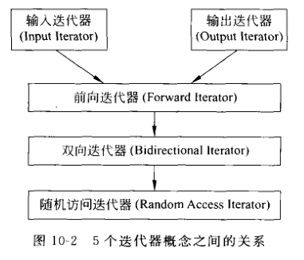

>迭代器是泛化的指针，STL算法利用迭代器对存储在容器中的元素序列进行遍历，迭代器提供了访问容器中每个元素的方法。
>>指针：可以指向内存中的一个地址，通过这个地址就可以访问相应的内存单元； 
>>迭代器：更为抽象，它可以指向容器中的一个位置，我们不必关心这个位置对应的真正物理地址，只需要通过迭代器访问这个位置的元素。
## 1. 输入流迭代器和输出流迭代器
### 1.1 输入流迭代器
输入流迭代器用来从一个输入流中连续地输入某种类型的数据，它是一个类模板。
例如：`template<class T>istream_iterator<T>;`

### 1.2 输出流迭代器
用来向一个输出流中连续输出某种类型的数据，也是一个类模板。
例如：`template<class T>ostream_iterator<T>;`

**引入这两种迭代器的意义：** 由于采用迭代器的接口，输入输出流可以直接参与STL的算法。输入输出流迭代器可以看作一种适配器。

**适配器(adapter)：** 指用于为已有对象提供新的接口的对象，适配器本身一般并不提供新的功能，只为了改变对象的接口而存在。

### 2. 迭代器的分类

