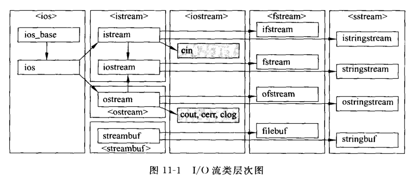
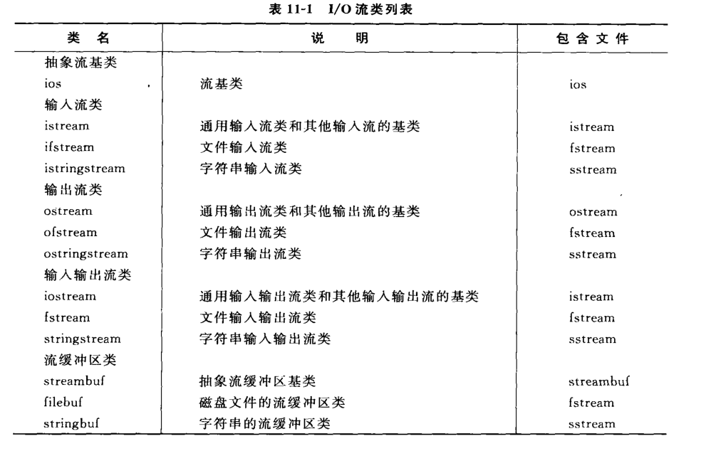
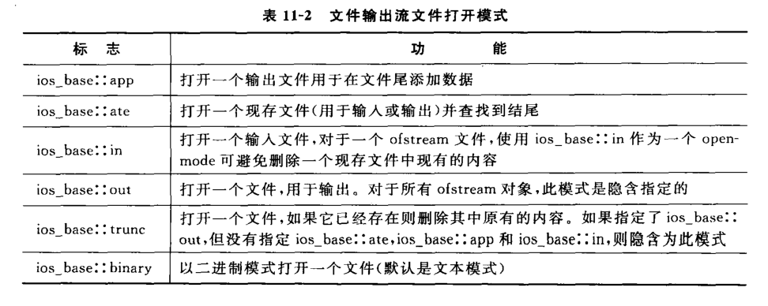
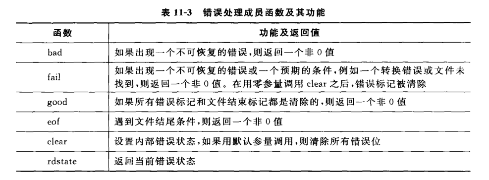

## 1. I/O流的概念及流类库结构

>当程序与外界环境进行信息交换时，存在两个对象，程序中的对象和文件对象

流：是一种抽象，它负责在数据的生产者和数据的消费者之间建立联系，并管理数据的流动。

>I/O流类库的基础是一组类模板，类模板提供了库中的大多数功能，而且可以作用于不同类型的元素。

>在I/O流类库中，头文件iostream声明了4个预定义的流对象用来完成在标准设备上的输入输出操作：cin, cout, cerr, clog

图11-1 给出了I/O流类库中面向char类型的个各类之间的关系。</br>
表11-1 是这些类的简要说明和使用它们时所需要包含的头文件名称。





>表11-1 列出头文件ios, iostream, ostream, streambuf 有时不必显式地被包含在源程序中，因为其中描述的都是类层次结构中的基类，已经被包含在其派生类所在的头文件中。

## 2. 输出流

最重要的：ostream, ofstream, ostringstream

ostream类对象用来完成向标准设备的输出：
* cout 是标准输出流；
* cerr 是标准错误输出流，没有缓冲，发送给它的内容立即被输出；
* clog 类似于cerr ，但是有缓冲，缓冲区满时被输出。

### 2.1 构造输出流对象

如果仅使用预先定义的cout, cerr 或 clog 对象，就不需要构造一个输出流。如果要使用文件流将信息输出到文件，便需要使用构造函数来建立流对象。

1. 使用默认构造函数，然后调用open 成员函数。例如：
    ``` c++
    ofstream myFile;
    myFile.open("filename");
    ```
2. 在调用构造函数时指定文件名：</br>
    `ofstream myFile("filename");`

3. 也可以使用同一个流先后打开不同的文件：
    ``` c++
    ofstream file;
    file.open("FILE1");
    // ...
    file.close();
    file.open("FILE2");
    // ...
    file.close();
    ```
### 2.2 使用插入运算符和操纵符
>很多操纵符都定义在ios_base类中（如hex()），以及iomanip头文件中（如setprecision()）。
    
    1. 输出宽度
        通过在流中放入setw 操纵符或嗲用width 成员函数为每个项指定输出宽度。参见 ./11_1.cpp 与 ./11_2.cpp
    2. 对齐方式
        参见 ./11_3(对齐方式).cpp
        setiosflags 影响持久，直到用resetiosflags 重新恢复时为止。
        常用的setiosflags操纵符：
- ios_base::skipws 在输入中跳过空白
- ios_base::left：左对齐值，用填充字符填充右边
- ios_base::right：右对齐值，用填充字符填充左边（默认对齐方式）
- ios_base::internal：在规定的宽度内，指定前缀符号之后，数值之前，插入指定的填充字符
- ios_base::dec：以十进制形式格式化数值（默认进制）
- ios_base::oct：以八进制形式格式化数值
- ios_base::hex：以十六进制形式格式化数值
- ios_base::showbase：插入前缀符号以表明整数的数制
- ios_base::showpoint：对浮点数值显示小数点和尾部的0
- ios_base::uppercase：对于十六进制数值显示大写字母A到F，对于科学格式显示大写字母E
- ios_base::showpos：对于非负数显示正号（“+”）
- ios_base::scientific：以科学格式显示浮点数值
- ios_base::fixed：以定点格式显示浮点数值（没有指数部分）
- ios_base::unitbuf：在每次插入之后转储并清除缓冲区内容

    3. 精度</br>
        浮点数默认精度为6，改变精度用 setprecision 操纵符（定义在 iomanip 中），此外还有两个标指会改变浮点数的输出格式，即 ios_base::fixed 和 ios_scientific，参见 ./11_4.cpp

    4. 进制</br>
        dec, oct, hex, 如果ios_base::upppercase(默认)标志已清除

### 2.3 文件输出流成员函数

与操纵符等价的成员函数；
执行非格式化写操作的成员函数；
其他修改流状态且不同于操纵符或插入运算符的成员函数。

1. **输出流的 open 函数**

    要使用一个文件输出流（ofstream），必须在构造函数或open函数中把该流与一个特定的磁盘文件按关联起来。
    打开一个与输出流关联的文件时，可以使用一个open_mode 标志，如表11-2，可以用按位或（“|”）运算符组合这些标志，他们作为枚举常量定义在ios_base 中。例如：
    ``` c++ 
    ofstream file("filename", ios_base::out|ios_base::binary);
    // 或
    ofstream file;
    file.open("filename", ios_base::out|ios_base::binary);
    // 表示打开模式的参数具有 ios_base::out, 可以省略
    ```


2. **输出流的close函数**

虽然ofstream 析构函数会自动完成关闭，但如果需要在同一流对象上打开另外的文件，就需要使用close 函数。

3. put函数

``` c++
cout.put('A');      // 精确地输出一个字符
cout<<'A';          // 输出一个字符，但此前设置的宽度和填充方式在此起作用
```

4. write函数

把一个内存中的一块内容写到一个文件输出流中，长度参数指出写的字节数。参见 11_5.cpp

5. seekp和tellp函数

一个文件输出流保存一个内部指针指出下一次写数据的位置。seekp 成员函数设置这个指针，因此可以以随机方式向磁盘文件输出。tellp 成员函数返回该文件位置指针。

6. 错误处理函数

作用是在写到一个流时进行错误处理。如表 11-3



### 2.4 二进制输出文件

最初设计流的目的时用于文本，因此默认的输出模式是文本方式，不同操作系统，文本文件的分隔符不大一样。例如linux一个换行符（'\n'，10）作为分行隔符，windows下以一个换行符和一个回车符（'\r', 13）作为分行隔符。如要二进制模式输出到文件，需要在打开时在打开模式中设置 `ios_base::binary`。例如：
``` c++
#include<fstream>
using namespace std;
int array[2]={99, 10};
int main(){
    ofstream os("test.dat", ios_base::out|ios_base::binary);
    os.write(reinterpret_cast<char *>(array), sizeof(array));
    return 0;
}
```

### 2.5 字符串输出流

ostringstream 类有两个构造函数。</br>
第一个函数有一个形参，表示流的打开模式，与文件输出流中的第二个参数功能相同，可取 表11-2 中的值，创建一个字符串i输出流：`ostringstream os;`</br>
第二个构造函数接收两个形参。第一个形参是string型常对象，用来为这个字符串流的内容设置初始值，第二个形参表示打开模式，与第一种构造函数的形参具有相同的意义。

ostringstream 类与 ofstream 类同为ostream 类的派生类，open 函数和 close 函数是 ostringstream类不具有。

ostringstream类还有一个特有的函数 str，它返回一个string对象，表示用该输出流生成字符串的内容。

ostringstream类的一个典型用法是将一个数值转化为字符串。参见 例11-6


## 3. 输出流

3个最重要的输入流类是 istream, ifstream, istringstream

1. istream 类最适合用于顺序文本模式输入。
2. ifstream 类支持磁盘文件输入。

### 3.1 构造输入流对象

如果仅使用 cin 对象，则不需要构造输入流对象。如果要使用文件流从文件中读取数据，就必须构造一个输入流对象。

1. 使用默认构造函数建立对象，然后调用open
   ``` c++
   ifstream myFile;
   myFile.open("filename"):
   ```
2. 在调用构造函数建立文件流对象时指定文件名和模式，在构造过程中打开该文件
    ``` c++
    ifstream myFile("filename");
    ```

### 3.2 使用提取运算符
提取运算符（“>>”）是用于格式化文本输入的，在提取数据时，以空白符为分隔。如果要输入一段包含空白符的文本，选择使用非格式化输入成员函数 getline

### 3.3 输出流操纵符

定义在 ios_base 类中和 iomanip 头文件中的操纵符可以应用于输出流。但是只有少数几个操纵符对输入流对象具有实际影响，其中最重要的是进制操纵符 dec, oct, hex。

### 3.4 输入流相关函数

1. 输入流的 open 函数

