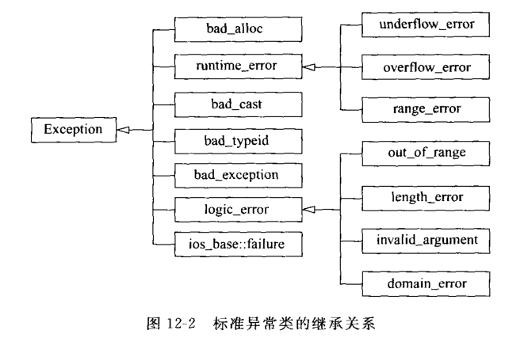

## 1. 基本思想


## 2. C++异常处理的实现
### 2.1 异常处理的语法

throw 表达式语法：

``` c++
throw 表达式
```

try 块语法：
``` c++
try
    复合语句
catch(异常表明)
    复合语句
catch(异常表明)
    复合语句
    ...
```
异常处理过程：
1. 程序通过正常的顺序执行到达try语句，然后执行try块内的保护段。
2. 如果在保护段执行期间没有引起异常，那么跟在try块后的catch子句就不执行。程序从异常被抛掷的try块后跟随的最后一个catch子句后面的语句继续执行下去。
3. 程序执行到一个throw表达式时，一个异常对象会被创建。若异常的抛出点本身在一个try子句内，则该try语句后的catch子句会按顺序检查异常类型是否与声明的类型匹配；若异常抛出点本身不在任何try子句内，或抛出的异常与各个catch子句所声明的类型皆不匹配，则结束当前函数的执行，回到当前函数的调用点，把调用点作为异常的抛出点，然后重复这一过程。此处理继续下去，直到异常成功被一个catch语句捕获。
4. 如果始终未找到与被抛掷异常匹配的catch子句，最终main函数会结束执行，则运行库函数terminate将被自动调用，而函数terminate的默认功能是终止程序。
5. 如果找到了一个匹配的catch子句，则catch子句后的复合语句会被执行。复合语句执行完毕后，当前的try块（包括try子句和一系列catch子句）即执行完毕。

### 2.2异常接口声明
``` c++
void fun() throw(A, B, C, D);   // fun()能够抛掷类型A, B, C, D

void fun();     // 可以抛掷任何类型的异常

void fun() throw();     // 不抛掷任何类型的异常
```

## 3. 异常处理中的构造与析构
在程序中，找到一个匹配的catch异常处理后，如果catch子句的异常声明是一个值参数，则其初始化方式是复制被抛掷的异常对象。如果catch子句的异常声明是一个引用，则其初始化方式是该引用指向异常对象。

C++异常处理的真正功能，不仅在于它能够处理各种不同类型的异常，还在于它具有为异常抛掷前构造的所有局部对象自动调用析构函数的能力。

栈的解旋(unwinding)：异常被抛出 ，从进入try块（与截获异常的catch子句相对应的那个try块）起，到异常被抛掷前，这期间在栈上构造（且尚未析构）的所有对象都会被自动析构，析构的顺序与构造的顺序相反。

## 4. 标准程序库异常处理

C++标准提供了一组标准异常类，这些类以基类 Exception 开始，标准程序库抛出的所有异常，都派生于该基类，这些类构成如图12-2所示的异常的派生继承关系。该基类提供了一个 成员函数 what()，用于返回错误信息（返回类型为 const char *）。在 Exception 类中，what() 函数的声明如下：
``` c++
virtual const char * what() const throw();
```



