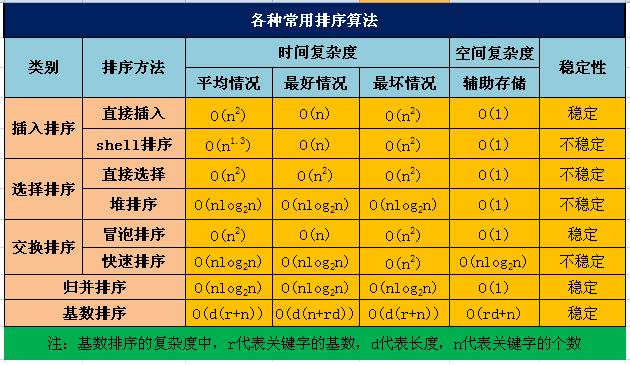

<<<<<<< HEAD

## 1.插入排序
基本思想：每一步将一个待排序元素按其关键字值的大小插入到已排序序列的适当位置上，直到待排序元素插入完为止。
.png)

## 2.选择排序
基本思想：每次从待排序序列中选择一个关键字最小的元素（当需要按关键字升序排列时），顺序排在已排列序列的最后，直至全部排完。
.png)

## 3.交换排序
基本思想：两两比较待排序序列中的元素，并交换不满足顺序要求的各对元素，直到全部满足顺序要求为止。最简单的交换排序方法是起泡排序。 
对具有n个元素的序列按升序进行起泡排序步骤： 
1. 将第一个元素与第二个元素进行比较，若为逆序，则将两元素交换。然后比较第二、第三个元素，以此类推，直到第n-1和第n个元素进行比较和交换。此过程为第一趟起泡排序。经过第一趟，最大的元素便被交换到第n个位置。
2. 对前n-1个元素进行第二趟起泡排序，将其中最大元素交换到第n-1个位置。
3. 以此继续，直到某一趟排序未发生任何交换时，排序完毕。对n个元素的序列，起泡排序最多需要进行n-1次。
.png)

## 4.顺序查找
基本思想：从数组的首元素开始，将元素逐个与待查找的关键字进行比较，直到找到相等的为止。

## 5.折半查找
基本思想：对于已按
=======
>>>>>>> b8db251afe8f48d8c4ce47f9c069236a9177c2b3
